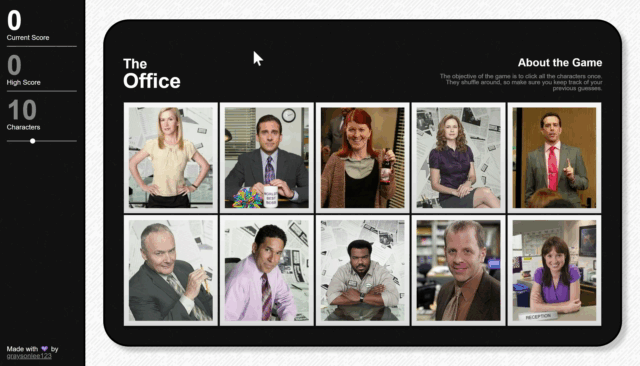
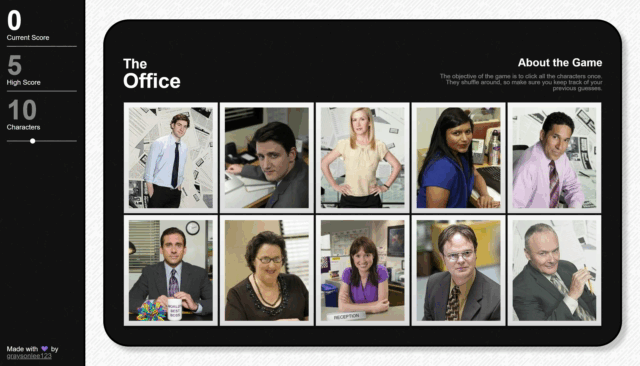

# "The Office (US)" Memory Game

### Click [here](https://graysonlee123.github.io/memory-game/) to play the game

A React webpage memory game. It uses React's components with local states. The components are conditionally rendered, and the state of components change throughout the game. 

## Preview
  

## Utilizes

React | [React-confetti](https://www.npmjs.com/package/react-confetti) | [gh-pages](https://www.npmjs.com/package/gh-pages)

### Acknowledgements
Thanks to [yoscheherazade](https://github.com/yoscheherazade) for providing some "The Office" quotes in JSON!
[Quotes](https://github.com/yoscheherazade/the-office-quotes-json/blob/master/quotes.json)
